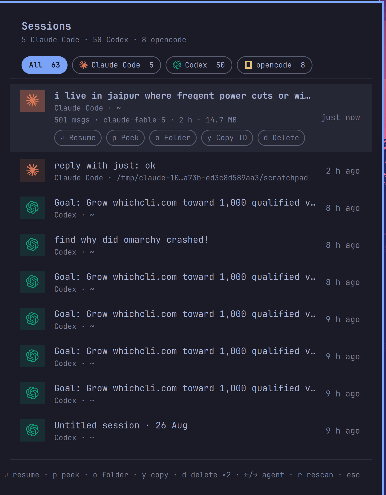

# Session Browser — Omarchy bar widget

A native [Omarchy](https://omarchy.org/) bar panel that answers: **what AI
coding sessions have I run on this machine, and how do I get back into one?**

It discovers past sessions from every AI agent CLI it can find — **Claude
Code, Codex, opencode**, plus Copilot CLI, Pi, and Gemini CLI the moment they
store sessions — and lists them newest-first with each vendor's logo, the
opening prompt or title, project directory, and relative age. Filter by agent
with one click, then **Enter resumes the session in a terminal**, opened in
its original working directory. The selected row expands with metadata
(message count, model, duration, size — plus token count and cost for
opencode) and per-session controls.



## What it runs, exactly

This plugin does more than observe, so here is the complete inventory. The
helper script is [`list-sessions`](list-sessions) — plain python3; read it
before installing, as you should for any shell plugin (Omarchy plugins run
unsandboxed).

**Scanning (on panel open or `r` — nothing polls in the background):**

- Reads session transcripts under `~/.claude/projects/`, `~/.codex/sessions/`,
  `~/.copilot/`, `~/.pi/agent/sessions/`, `~/.gemini/tmp/`, and opencode's
  sqlite database (opened read-only). Local reads only; **no network access,
  no telemetry, nothing written to disk**.
- **Hard bounds at capture time:** at most 50 sessions per agent; transcript
  lines over 256 KB are skipped, titles capped at 90 characters, and the
  panel refuses any helper payload over 1 MB before `JSON.parse`. All
  session-derived text renders as plain text (`Text.PlainText`).

**Actions (each runs only on your explicit click/keypress on that row):**

- **Resume** — launches that agent's own resume command (`claude --resume
  <id>`, `codex resume <id>`, `opencode -c`, …) in a new terminal via
  `xdg-terminal-exec`, `cd`'d to the session's directory.
- **Peek** — renders the transcript (control characters stripped, 400-block
  cap) into a floating terminal with `less`.
- **Folder** — opens the session's directory with `xdg-open`.
- **Copy ID** — copies the session id with `wl-copy`.
- **Delete** — permanently removes that one session (transcript files, or
  `opencode session delete`). Requires a second confirming press, and is
  offered only for agents where deletion is well-defined.
- Session ids are validated against strict per-agent patterns before any
  action runs; anything else is refused. **No sudo, no pkexec, no polkit.**

The screenshot above shows the author's own machine.

## Requirements

Omarchy 4.x. `python3`, `wl-clipboard`, and the floating terminal all ship
with Omarchy. The agent CLIs themselves are optional — each agent appears
only when it has sessions on disk.

## Install

```bash
omarchy plugin add https://github.com/Sudhanshugtm/omarchy-session-browser.git --enable
```

## Use

| Action | Result |
|---|---|
| Left-click bar icon | Open the session list |
| Click a row / `Enter` | Resume that session in a terminal |
| Arrows | Move selection (list auto-scrolls) |
| `←`/`→` or pill click | Filter by agent |
| `p` | Peek at the transcript |
| `o` | Open the session's folder |
| `y` | Copy the session id |
| `d` `d` | Delete the session (double-press to confirm) |
| `r` | Rescan |
| `Esc` | Close panel |

IPC target for keybindings: `omarchy-shell sid.sessions toggle`.

## Remove

```bash
omarchy plugin remove sid.sessions
```

Deletes the plugin folder and removes the widget from the bar. Your agents'
session stores are never touched by removal.

## Credits

Agent logos are from [Simple Icons](https://simpleicons.org/) (CC0);
trademarks and logos remain the property of their respective owners and
appear here for identification only.

## License

MIT — see [LICENSE](LICENSE).
